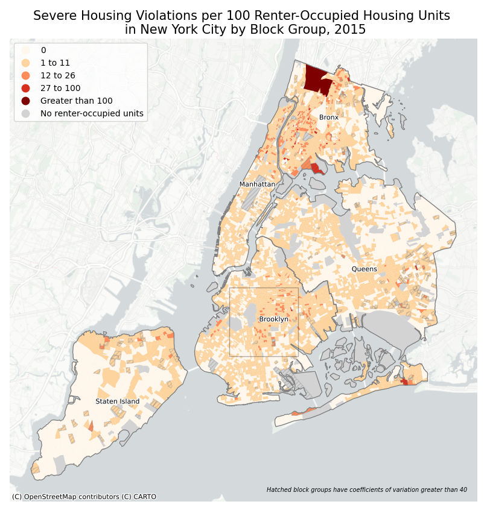
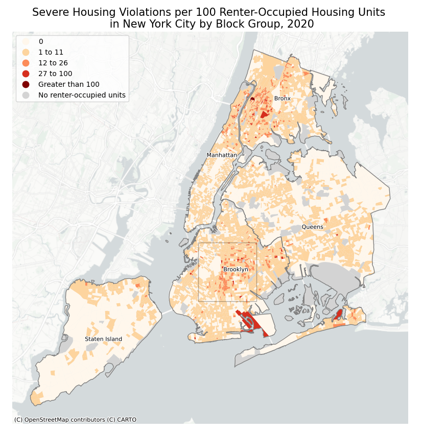
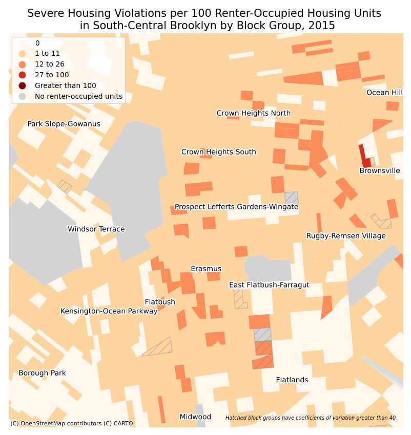
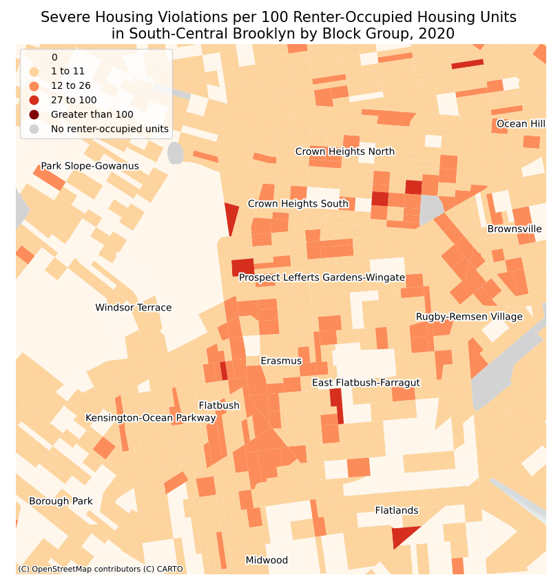

# Housing Violations in New York City
#### Katie Jurenka | Command-Line GIS 34:970:595

Housing maintenance code violations are issued by the New York City Department of Housing Preservation and Development (HPD) against rental dwelling units that violate New York City Housing Maintenance Code (HMC) or the New York State Multiple Dwelling Law (MDL). The dataset began with violations open as of October 1, 2012 and is updated daily. Inspectors categorize violations by code. For the purposes of this project, I focused on severe housing violations that especially impact habitability and health, including the presense of lead-based paint, mold, or pests/vermin, and lack of hot water or heat. Most records already contained location information, but some records (~.1%) did not and were excluded from this analysis. I focused on 2015 and 2020 violations based on the actual inspection date in order to make the dataset more manageable and compare two times periods. I decided to exclude data from before October 1, 2012 because prior violations were only included if they were still open as of that date. For more information on the housing violation dataset, see [NYC Open Data](https://data.cityofnewyork.us/Housing-Development/Housing-Maintenance-Code-Violations/wvxf-dwi5/about_data).

I also used the 2015 American Community Survey 5-year estimates and the 2020 Decennial Census. I normalized housing violations by total renter-occupied housing units by block group, which required a spatial join of the housing violation data, which were points, to the census block group data. I calculated coefficients of variation for 2015 ACS data and symbolized low reliability block groups (those with CVs greater than 40) with hatching.

I'm interested in how the spatial pattern of housing violations have changed over time. I used housing violation data from HPD because they are confirmed by a housing inspector and likely demonstrate especially severe habitability issues because tenants with responsive management would typically contact maintenance staff or their landlord to resolve the issue. Reporting an issue to HPD likely indicates a severe, chronic problem and a neglectful landlord. While this dataset demonstrates the general trend of habitability issues in NYC, there are also tenants that live in apartments with severe issues that don't report to HPD for many reasons, including tenants living in illegal apartments, tenants with undocumented status or tenants with other challenges navigating the process.

### Maps of Severe Housing Violations
The following maps show severe housing violations per 100 renter-occupied housing units in 2015 and 2020 for the city as a whole. I also created a map of south-central Brooklyn because the rate of severe violations increased in this area between 2015 and 2020. There are some outliers with very few renter-occupied units that skew the results, but the overall spatial pattern in both years demonstrates higher rates of violations in central and eastern Brooklyn, much of the Bronx and the Manhattan neighborhood of Inwood. The north shore of Staten Island, eastern Queens, the Rockaways and Harlem also have block groups with significant violation rates. Many block groups in Staten Island and eastern Queens have low reliability renter-occupied unit data, likely because these neighborhoods contain more owner-occupied units. 2020 data shows a similar pattern with more clustering in the Bronx and central Brooklyn. Block groups in central Brooklyn in particular appeared to have violation rate increases. In 2015, the neighborhoods of Flatbush, Erasmus, Prospect Lefferts Gardens and Crown Heights contain some block groups with 12-26 violations per 100 renter-occupied units. Some block groups have 0 violations, and many have 1-11 violations per rental unit. In 2020, more block groups are in the 12-26 range, especially surrounding Flatbush Avenue, which runs north-south in the neighborhood of Flatbush. Several block groups are now in the 27-100 violations per rental unit range. 

The response to the COVID-19 pandemic could have influenced overall housing violations. New York state enacted an eviction moratorium, which could have influenced landlords' responsiveness to tenant concerns. The pandemic could have also made it more difficult to make repairs and address issues. HPD housing inspectors continued inspections throughout the pandemic, but I'm not sure if staff capacity was an issue.  

 

 

### Interactive Maps
The interactive maps below contain the same housing violations rates and a heatmap of severe housing violations for each year. 

#### 2015 Severe Housing Violations
<iframe src="2015.html" height = "500" width="1000"></iframe>

#### 2020 Severe Housing Violations
<iframe src="2020.html" height = "500" width="1000"></iframe>
